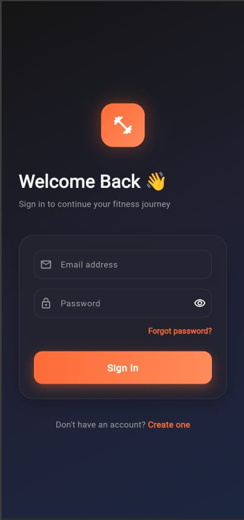

# RevFit: AI-Powered Fitness & Nutrition Companion

Welcome to **RevFit**, an all-in-one AI-powered health assistant that helps users track, plan, and analyze their fitness and nutrition goals. The application combines a personalized recommender engine, custom workout and diet planning, a responsive AI chatbot, and a deep learning-based computer vision pipeline for automated exercise classification and pose analysis.

---

## 🚀 Key Features

### 1. Automated Exercise Classification (Phase 1)
- **Deep Learning Ensemble:** Classifies exercise clips into a 20-class taxonomy using a 50/50 hybrid ensemble of **VideoMAE** (Vision Transformer) and **X3D-M** (3D CNN).
- **Graceful Fallback:** Integrated mock classification fallback for development and testing environments without full PyTorch model configurations.

### 2. Pose Analysis & Form Correction (Phase 2)
- **Skeletal Assessment:** Uses headless OpenCV and MediaPipe to calculate skeleton angles and form correctness from uploaded workout videos.
- **Dynamic Rep Counting:** Streams video frames into a `RepetitionCounter` engine for robust, real-time rep detection.
- **Visual Feedback:** Generates annotated form-correction video overlays with visual callouts on posture adjustments.

### 3. Nutrition & Workout Recommendation Engines
- **BMR & TDEE Calculations:** Leverages the Mifflin-St Jeor formula to determine calorie targets and macros tailored to goals (e.g., fat loss, muscle gain, maintenance).
- **Spoonacular Meal Planner:** Recommends detailed recipes and daily meal structures mapped precisely to daily macronutrient slot requirements (breakfast, lunch, dinner, snacks).
- **Workout Split Recommendations:** Generates customized Push/Pull/Legs, Upper/Lower, or Full Body routines matching user experience and available equipment.
- **Scoring & Time-Decay Feedback Loop:** Features a content-based filtering model with custom user feedback memory and exponential preferences decay.

### 4. Interactive Cross-Platform GUI
- **Modern User Experience:** Built with Flutter, featuring sleek light/dark modes, dashboard analytics, and clean typography.
- **Feature-Rich Screens:**
  - **Dashboard / Home Screen:** Track overall progress and access recommendations.
  - **Diet & Meal Planner:** Daily macro charts and meal cards linked directly to recipes.
  - **Workout Generator:** Visual guide for routine logs.
  - **Video Upload / Camera Feed:** Upload or record workout videos for instant pose analysis.
  - **AI Chatbot:** Virtual personal trainer support inside the application.

---

## 📸 Screenshots

Here are some screenshots showcasing the application's user interface and features:

| Login | Registration |
| :---: | :---: |
|  |  |

| Onboarding Questionnaire - Page 1 | Onboarding Questionnaire - Page 2 |
| :---: | :---: |
|  |  |

| User Dashboard | Post-Workout Analysis |
| :---: | :---: |
|  |  |

| Workout Recommendations | Diet Recommendations |
| :---: | :---: |
|  |  |

---

## 🛠 Project Structure

- **`/backend`**: FastAPI backend service. Houses the recommendation logic, databases, feedback stores, and ML model inference code.
- **`/lib`**: Flutter frontend codebase including layout screens, state management, and API services.
- **`/Pose`**: Independent computer vision pipelines and pose-scoring helpers.
- **`/recommender_sys`**: Core recommendation logic experiments and testing resources.

---

## ⚙️ How to Run the Project

Follow these instructions to start the backend and frontend components.

### 1. Running the Backend
The backend runs on **FastAPI** and uses Python. Run the following commands to set up the virtual environment, install dependencies, and launch the server:

```bash
# Navigate to the backend directory
cd backend

# Activate the Python virtual environment
source .venv/bin/activate

# Install required dependencies
pip install -r requirements.txt

# Run the database/main startup script
python main.py

# Launch the FastAPI web server with hot reload
uvicorn main:app --reload
```

Once running, the backend server defaults to `http://localhost:8000`. You can access the interactive API documentation (Swagger UI) at `http://localhost:8000/docs`.

### 2. Running the GUI (Flutter Frontend)
The frontend is built with Flutter and supports mobile, web, and desktop. Ensure your Flutter environment is configured, and run:

```bash
# Execute the Flutter application
flutter run
```

Ensure the backend server is running in the background so the frontend can retrieve user session data, workout recommendations, and process uploaded video files.

### 3. Running the Pre-built Windows Release
For a quick launch on Windows without compiling from source, a pre-built executable is available:
- **Release Executable Path:** `build/windows/x64/runner/Release/gym2.exe`
- **Shortcut Path:** `gym2.exe - Shortcut.lnk`
